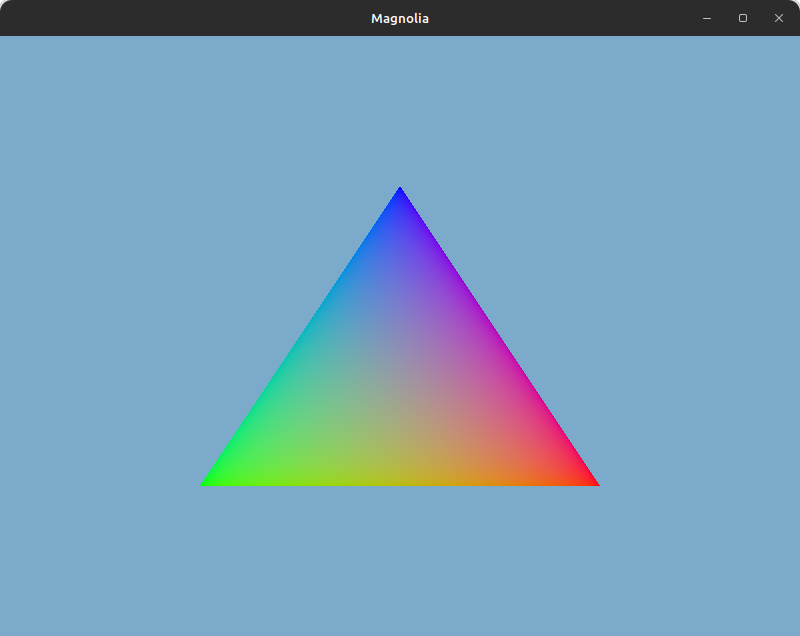

# Magnolia


> Current state of the engine

## Requirements
<!-- Add links -->
- C++20
- Gcc 11.4.0
- Python 3.10.12
- Cmake 3.22.1
- Vulkan SDK 1.1.198

## Build
To build and run the program use

```
python3 build.py debug
```

## References
- [VulkanAbstractionLayer](https://github.com/asc-community/VulkanAbstractionLayer)
- [Godot](https://github.com/godotengine/godot)
- [VulkanTutorial](https://github.com/Overv/VulkanTutorial)
