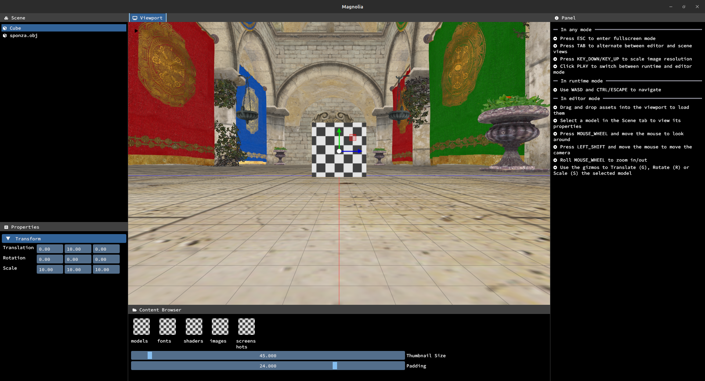

# Magnolia


> Current state of the engine

## Requirements
<!-- Add links -->
- C++20
- Gcc 11.4.0
- Python 3.10.12
- Cmake 3.22.1
- Vulkan SDK 1.3.268

## Build
To build and run the program use

```
python3 build.py debug
```

## References
- [[VulkanAbstractionLayer](https://github.com/asc-community/VulkanAbstractionLayer)] Renderer architecture and core structures
- [[Godot](https://github.com/godotengine/godot)] Lib management
- [[VulkanTutorial](https://github.com/Overv/VulkanTutorial)] Vulkan foundations
- [[VkGuide](https://github.com/vblanco20-1/vulkan-guide)] Render to texture and other vulkan optimizations
- [[ASliceOfRendering](https://asliceofrendering.com/scene%20helper/2020/01/05/InfiniteGrid/)] Generating an infinite grid using shaders
- [[Hazel](https://github.com/TheCherno/Hazel)] Content browser and other editor widgets
- [[FontAwesome](https://github.com/FortAwesome/Font-Awesome/)] Icon fonts
- [[IconFontCppHeaders](https://github.com/juliettef/IconFontCppHeaders)] Font awesome for C++
