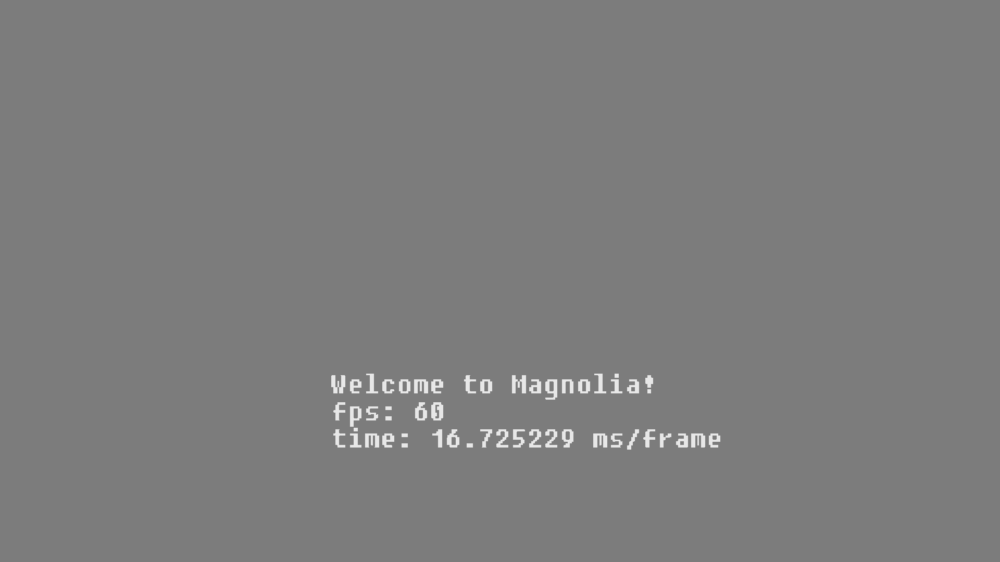

# Magnolia



> Current state of the engine

> Windows build is still in development (for now is linux only)!

## Requirements

<!-- Add links -->

- C++23
- GCC 13.3.0
- Clang 21.1.6
- Python 3.14.2
- Cmake 4.2.2
- Vulkan SDK 1.3.268
- [Mold linker](https://github.com/rui314/mold) (Optional, can be removed/swapped by changing the `-fuse-ld` field in the [`build.py`](build.py) file)

## Build

To build the program use

```
python3 build.py build debug
```

The executables for your system can be found in the `build` folder

## References

- [[VulkanAbstractionLayer](https://github.com/asc-community/VulkanAbstractionLayer)] Renderer architecture and core structures
- [[Godot](https://github.com/godotengine/godot)] Lib management
- [[VulkanTutorial](https://github.com/Overv/VulkanTutorial)] Vulkan foundations
- [[VkGuide](https://github.com/vblanco20-1/vulkan-guide)] Render to texture and other vulkan optimizations
- [[ASliceOfRendering](https://asliceofrendering.com/scene%20helper/2020/01/05/InfiniteGrid/)] Generating an infinite grid using shaders
- [[Hazel](https://github.com/TheCherno/Hazel)] Content browser and other editor widgets
- [[FontAwesome](https://github.com/FortAwesome/Font-Awesome/)] Icon fonts
- [[IconFontCppHeaders](https://github.com/juliettef/IconFontCppHeaders)] Font awesome for C++
- [[OGLDEV](https://www.youtube.com/watch?v=9HO1dl0zcxg)] Mesh optimizations using meshoptimizer
- [[LearnOpenGL](https://learnopengl.com/Lighting/Basic-Lighting)] Lighting and basic computer graphics concepts
- [[LearnOpenGL](https://learnopengl.com/In-Practice/Text-Rendering)] Basic text rendering
- [[WickedEngine](https://wickedengine.net/)] ECS and other graphics systems
- [[Kohi](https://github.com/travisvroman/kohi)] Rendering systems, native data file formats
- [[Scion2D](https://github.com/dwjclark11/Scion2D)] Lua scripting
- [[podgorskiy](https://gist.github.com/podgorskiy/e698d18879588ada9014768e3e82a644)] Frustum culling
- [[Inigo Quilez](https://iquilezles.org/articles/frustumcorrect/)] Frustum culling algorithm
- [[OpenGLTutorial](https://www.opengl-tutorial.org/intermediate-tutorials/billboards-particles/billboards/)] Billboarding
- [[Vulkan-glTF-PBR](https://github.com/SaschaWillems/Vulkan-glTF-PBR)] PBR and tonemapping algorithms
- [[Filmic Worlds](http://filmicworlds.com/blog/filmic-tonemapping-operators/)] Tonemapping algorithms
- [[glTF-Sample-Models](https://github.com/KhronosGroup/glTF-Sample-Models)] Better quality test models
